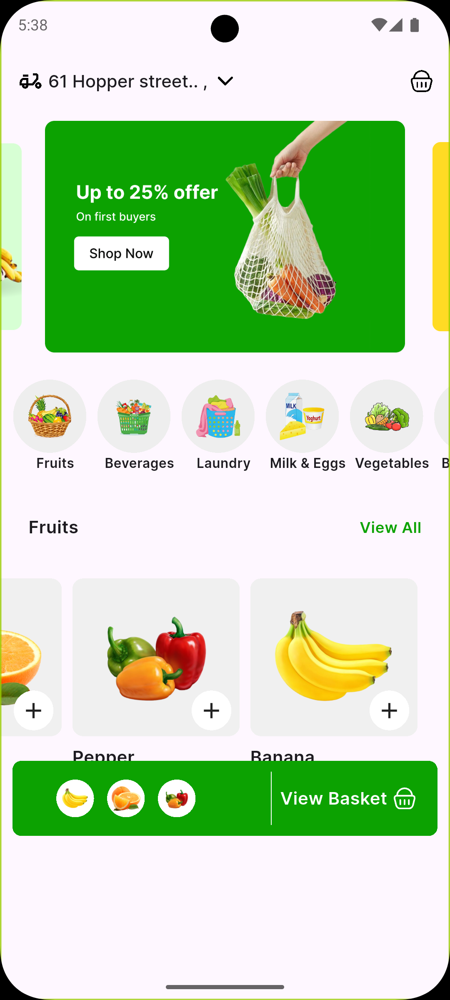

🍉 Flutter UI – Simple Fruit App

A clean and modern Flutter UI for a simple fruit shopping experience.
Includes banner slider, category section, product cards, and responsive layout.

## 🖼️ Screenshots

### 🚀 Splash Screen

### 🔐 Home Page

🏠 Home Page

🍓 Product Card

🍊 Categories

🔧 Features

Banner Carousel Slider

Categories list

Product cards with image, name, rating, and price

Soft colors and clean UI

Google Fonts

SVG icons

Responsive layout

Reusable widgets (CustomCard, Models, etc.)

📦 How to Run
1️⃣ Install packages
flutter pub get

2️⃣ Run the app
flutter run

🛠️ Dependencies
dependencies:
  flutter:
    sdk: flutter
  carousel_slider: ^5.0.0
  google_fonts: ^6.1.0
  flutter_svg: ^2.0.10

📁 Folder Structure
lib/
 ├── models/
 │    ├── product_model.dart
 │    └── category_model.dart
 ├── widgets/
 │    └── custom_card.dart
 ├── HomePage.dart
 └── main.dart

📝 Assets Setup
1️⃣ Create the folder structure:
assets/
 ├── banners/
 ├── category/
 ├── products/
 └── readme/

2️⃣ Add your README images:
assets/readme/home.png
assets/readme/card.png
assets/readme/categories.png

3️⃣ Enable assets in pubspec.yaml:
flutter:
  assets:
    - assets/banners/
    - assets/category/
    - assets/products/
    - assets/readme/

📙 Notes

This project is perfect for practicing UI design and Flutter layout

You can easily add more products, categories, or pages

Code structure is simple and clean for beginners
