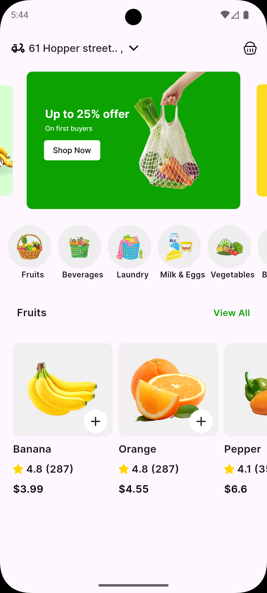

Sure Abdullah — here's your **clean, professional, and well-formatted README**, fixed and organized beautifully 👇
(Perfect for GitHub, with emojis, spacing, and structure.)

---

# 🛍️ Flutter Shop UI

A clean and modern Flutter UI project featuring product cards, categories, banner slider, reusable widgets, and responsive layout.

---

## 🏠 Home Page Features

* 🎞️ **Banner Carousel Slider**
* 🍊 **Categories List**
* 🍓 **Product Cards** (image, name, rating, price)
* 🎨 **Soft colors & clean UI**
* ✒️ **Google Fonts**
* 🧩 **SVG icons**
* 📱 **Responsive layout**
* ♻️ **Reusable widgets** (CustomCard, Models, etc.)

---

## 📸 Screenshots





## 📦 How to Run

### 1️⃣ Install packages

flutter pub get

### 2️⃣ Run the app

flutter run


## 🛠️ Dependencies

```yaml
dependencies:
  flutter:
    sdk: flutter
  carousel_slider: ^5.0.0
  google_fonts: ^6.1.0
  flutter_svg: ^2.0.10
```


## 📁 Folder Structure

```
lib/
├── models/
│   ├── product_model.dart
│   └── category_model.dart
├── widgets/
│   └── custom_card.dart
├── HomePage.dart
└── main.dart
```

---

## 🖼️ Assets Setup

### 1️⃣ Create folder structure

```
assets/
├── banners/
├── category/
├── products/
└── readme/
```

### 2️⃣ Add your README images

```
assets/readme/home.png
assets/readme/card.png
assets/readme/categories.png
```

### 3️⃣ Enable in `pubspec.yaml`

```yaml
flutter:
  assets:
    - assets/banners/
    - assets/category/
    - assets/products/
    - assets/readme/


## 📙 Notes

* Perfect for practicing **Flutter UI design**
* You can easily add more **products, categories, pages**
* Simple and clean **structure for beginners**
* Great starter template for e-commerce UI


